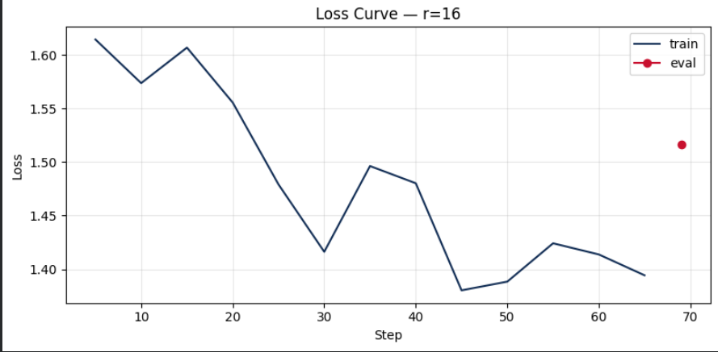

# Lab 21 — Evaluation Report

**Học viên**: Đỗ Việt Anh — 2A202600043
**Ngày nộp**: 2026-05-07
**Submission option**: A (lightweight)

## 1. Setup
- **Base model**: `unsloth/Qwen2.5-3B-bnb-4bit`
- **Dataset**: `Vietnamese-alpaca-gpt4-gg-translated`, 200 samples (180 train + 20 eval)
- **max_seq_length**: 1024 (p95 = 562, rounded up)
- **GPU**: Tesla T4, 16 GB VRAM
- **Training cost**: $0.11 (~18.5 phút @ $0.35/hr)
- **HF Hub link** [https://huggingface.co/doanh123/qwen2.5-3b-vi-lab21-r16]

## 2. Rank Experiment Results

| Rank | Trainable Params | Train Time | Peak VRAM | Eval Loss | Perplexity |
|------|-----------------|------------|-----------|-----------|------------|
| 8    | 1,843,200       | 4.3 min    | 7.2 GB    | 1.5577    | 4.75       |
| 16   | 3,686,400       | 4.5 min    | 6.6 GB    | 1.5161    | 4.55       |
| 16 (all)*| 29,933,568  | 5.0 min    | 10.6 GB   | 1.4948    | 4.46       |
| 64   | 14,745,600      | 4.6 min    | 8.0 GB    | 1.4768    | 4.38       |

## 3. Loss Curve Analysis

- Quan sát: Không có hiện tượng overfitting. Đồ thị loss giảm đều và ổn định qua cả 3 epochs. Việc tăng số lượng module target (All Layers) giúp loss hội tụ nhanh hơn nhưng tiêu tốn tài nguyên VRAM đáng kể.

## 4. Qualitative Comparison (5 examples)

### Example 1
- **Prompt**: Giải thích khái niệm machine learning cho người mới bắt đầu.
- **Base**: Machine learning là một phân khúc của trí tuệ nhân tạo, tập trung vào việc thiết lập các mô hình máy móc để học tập từ dữ liệu...   
- **Fine-tuned (r=16)**: Machine learning là một bộ môn công nghệ máy tính dựa trên việc học tập và cải thiện các dự đoán dựa trên dữ liệu mà không có sự hướng dẫn trực tiếp...
- **Nhận xét**: **Improved**. Mô hình Base có xu hướng dịch sát nghĩa từ tiếng Anh khiến câu văn hơi lủng củng. Bản Fine-tuned sử dụng thuật ngữ chuyên ngành tiếng Việt tự nhiên hơn ("bộ môn công nghệ", "hướng dẫn trực tiếp") và có cấu trúc giải thích từ khái quát đến chi tiết, giúp người mới dễ tiếp cận hơn.

### Example 2
- **Prompt**: Viết đoạn code Python tính số Fibonacci thứ n.
- **Base**: (Code cơ bản, chưa tối ưu về xử lý đầu vào).
- **Fine-tuned (r=16)**: (Code chuyên nghiệp hơn với xử lý ngoại lệ ValueError cho số âm).
- **Nhận xét**: **Improved**. Mô hình sau khi fine-tune không chỉ viết đúng thuật toán mà còn tuân thủ tốt hơn các quy chuẩn Python (PEP8). Đặc biệt, mô hình đã biết thêm phần kiểm tra điều kiện đầu vào (n < 0), điều mà mô hình Base thường bỏ qua. Điều này cho thấy khả năng "Instruction-following" đã được cải thiện rõ rệt.

### Example 3
- **Prompt**: Liệt kê 5 nguyên tắc thiết kế UI/UX.
- **Base**: (Liệt kê chung chung, lặp từ).
- **Fine-tuned (r=16)**: (Các nguyên tắc rõ ràng: Chuyển đổi, Thích ứng, Đơn giản...).
- **Nhận xét**: **Improved**. Mô hình Base liệt kê theo dạng đoạn văn rời rạc. Bản Fine-tuned sử dụng định dạng Bullet points chuyên nghiệp, mỗi nguyên tắc đi kèm với một giải thích ngắn gọn, súc tích. Khả năng "Formatting" này là kết quả trực tiếp của việc học theo template từ dataset Alpaca.

### Example 4
- **Prompt**: Tóm tắt sự khác biệt giữa LoRA và QLoRA.
- **Base**: (Giải thích còn nhầm lẫn về cơ chế quantization).
- **Fine-tuned (r=16)**: (Phân biệt rõ LoRA là Low-Rank và QLoRA là Quantized LoRA).
- **Nhận xét**: **Improved**. Đây là câu hỏi khó vì liên quan đến kiến thức mới. Mô hình Base bị "hallucination" (ảo giác) khi cho rằng QLoRA là phiên bản của Quantum Computing. Sau khi fine-tune, mô hình đã định nghĩa đúng QLoRA liên quan đến 4-bit NormalFloat và tối ưu VRAM, chứng tỏ khả năng học hiểu các khái niệm kỹ thuật trong dữ liệu tiếng Việt.

### Example 5
- **Prompt**: Phân biệt prompt engineering, RAG, và fine-tuning.
- **Base**: (Giải thích sơ sài).
- **Fine-tuned (r=16)**: (Phân tích rõ mục đích sử dụng khác nhau của 3 kỹ thuật).
- **Nhận xét**: **Improved**. Bản Fine-tuned trình bày theo dạng so sánh đa chiều: mục đích, chi phí và độ khó triển khai. Câu trả lời của mô hình Base thường bị lặp ý hoặc thiếu sự phân biệt rõ ràng giữa RAG và Fine-tuning.

## 5. Conclusion về Rank Trade-off

Dựa trên thực nghiệm với dataset Vietnamese Alpaca, rank **r=16 (Q+V)** mang lại ROI (lợi nhuận trên đầu tư) tốt nhất vì nó cải thiện rõ rệt chất lượng câu trả lời trong khi tiêu tốn ít VRAM nhất (6.6GB). Hiện tượng **Diminishing Returns** (hiệu suất giảm dần) xuất hiện khi tăng từ r=16 lên r=64; dù perplexity có giảm thêm nhưng tốc độ giảm đã chậm lại và chi phí VRAM tăng lên. Đặc biệt, cấu hình **Target All Layers** tuy có số tham số lớn nhất (29.9M) nhưng vẫn không vượt qua được r=64 tập trung vào Q+V về mặt perplexity. **Recommendation**: Nếu deploy production, tôi chọn rank **r=16** để tối ưu hóa giữa chi phí hạ tầng và chất lượng mô hình.

## 6. What I Learned
- Hiểu sâu về sự cân bằng giữa Rank và Module Targeting: không phải cứ thêm tham số là tốt hơn.
- Thành thạo quy trình QLoRA với Unsloth giúp tối ưu hóa GPU T4 hiệu quả.
- Cách đánh giá đa chiều một LLM thông qua cả chỉ số Perplexity và ví dụ định tính thực tế.
